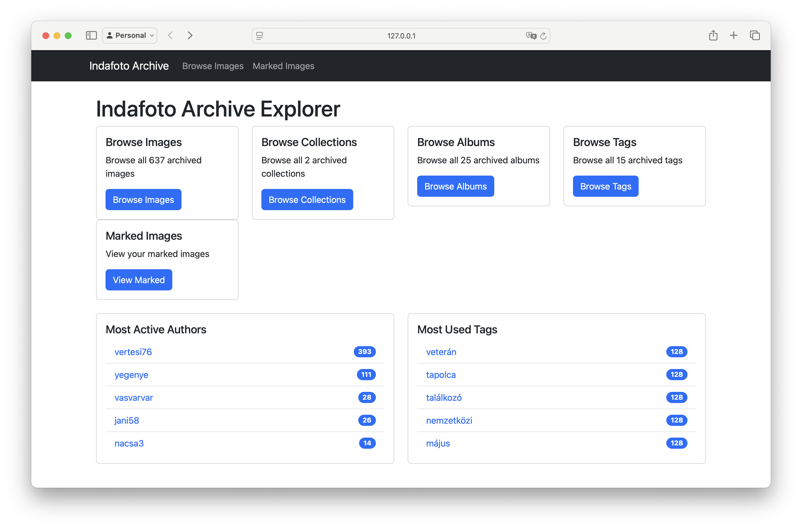

# Indafoto Archive Tools

This repository contains two main tools for archiving and exploring photos from indafoto.hu:
1. Indafoto Crawler - For downloading and archiving images
2. Archive Explorer - For browsing and organizing the archived content

## Indafoto Crawler

The crawler allows you to archive photos from indafoto.hu before the service shuts down.

The default setting is to save freely licensed images. Change SEARCH_URL_TEMPLATE in indafoto.py if you want to save images based on different criteria (e.g. username)

### Prerequisites

- Python 3.6 or higher (tested with 3.13)
- Internet connection

### Setup Instructions

#### Step 1: Download the Project

If you received this as a ZIP file, extract it to a folder on your computer.

If you need to download it from GitHub:
1. Go to the repository page
2. Click the green "Code" button
3. Select "Download ZIP"
4. Extract the ZIP file to a folder on your computer

##### Alternative: Using Git (Recommended for easy updates)

<details>
<summary>Click to expand: Using Git for installation and updates</summary>

If you're familiar with Git, you can clone the repository directly:

1. If you don't have Git installed, download and install it from [git-scm.com](https://git-scm.com/downloads)

2. Open a command prompt or terminal

3. Run the following command:
   ```
   git clone https://github.com/bdamokos/indafoto_archive.git
   cd indafoto_archive
   ```

This method has the advantage of making updates easier. When new features or fixes are available, you can update your local copy by running:
   ```
   git pull
   ```

The `git pull` command fetches changes from the remote repository and automatically merges them into your local copy, ensuring you always have the latest version without needing to download the entire project again.
</details>


#### Step 2: Install Python

If you don't have Python installed:

1. Go to [python.org](https://www.python.org/downloads/)
2. Download the latest version for your operating system
3. Run the installer
   - On Windows: Make sure to check "Add Python to PATH" during installation
   - On Mac/Linux: The installer should handle this automatically

#### Step 3: Install Required Packages

1. Open a command prompt or terminal
   - On Windows: Press Win+R, type `cmd` and press Enter
   - On Mac: Open Terminal from Applications > Utilities
   - On Linux: Open your terminal application

2. Navigate to the project folder:
   ```
   cd path/to/indafoto_archive
   ```
   (Replace "path/to/indafoto_archive" with the actual path to where you extracted the files)

3. You have two options for installing the required packages:

   **Option A - Simple Install (System-wide):**
   ```
   pip install -r requirements.txt
   
   # If that doesn't work, try:
   python -m pip install -r requirements.txt
   # OR on Windows:
   py -m pip install -r requirements.txt
   ```

   **Option B - Using Virtual Environment (Recommended Best Practice):**
   
   Virtual environments are a best practice for Python development. They create an isolated space for project dependencies, but they're optional - the script will work fine with a system-wide installation too.

   **For Windows:**
   ```
   # Create and activate virtual environment
   python -m venv .venv
   .venv\Scripts\activate
   
   # Install packages
   pip install -r requirements.txt
   ```

   **For macOS/Linux:**
   ```
   # Create and activate virtual environment
   python3 -m venv venv
   source venv/bin/activate
   
   # Install packages
   pip install -r requirements.txt
   ```

   Note: If you see `(.venv)` at the start of your command prompt, the virtual environment is activated correctly.

<details>
<summary>Click to expand: Virtual Environment Troubleshooting</summary>

**Windows Troubleshooting:**
- If `python -m venv .venv` fails, try:
  ```
  py -m venv .venv
  ```

- For activation, try these commands until one works:
  ```
  .venv\Scripts\activate.bat
  # OR
  .venv\Scripts\activate
  # OR if using PowerShell:
  .venv\Scripts\Activate.ps1
  ```

- If you get a "not digitally signed" error in PowerShell, run:
  ```
  Set-ExecutionPolicy -ExecutionPolicy RemoteSigned -Scope CurrentUser
  ```

- If python/py commands aren't found, ensure Python is added to PATH:
  1. Search for "Environment Variables" in Windows
  2. Click "Environment Variables" under System Properties
  3. Under "System Variables", find and select "Path"
  4. Click "Edit" and check if Python paths are listed
  5. If not, add Python installation directory (typically `C:\Users\YourUsername\AppData\Local\Programs\Python\Python3x` and `C:\Users\YourUsername\AppData\Local\Programs\Python\Python3x\Scripts`)

**Note:** If you're having trouble with virtual environments, you can skip this step and use Option A (Simple Install) instead. The script will work fine either way.
</details>

### Running the Tools

#### Archive Submitter

The archive submitter should be run as a separate process from the crawler:

```bash
python archive_submitter.py  # Start in one terminal
python indafoto.py          # Start in another terminal
```

#### Crawler Usage

1. If you used a virtual environment, make sure it's activated:
   ```
   # On Windows:
   .venv\Scripts\activate
   
   # On macOS/Linux:
   source venv/bin/activate
   ```

2. Basic usage:
   ```
   python indafoto.py
   ```

2. Available command-line arguments:
   ```
   python indafoto.py --start-offset N  # Start crawling from page N
   python indafoto.py --retry           # Retry previously failed pages
   python indafoto.py --test            # Run test function for album extraction
   python indafoto.py --workers N       # Set number of parallel download workers (default: 8)
   ```

   You can combine arguments:
   ```
   python indafoto.py --start-offset 100 --workers 4
   ```

#### Worker Optimization

Before starting the crawler, you can optimize the number of parallel download workers for your system:

```bash
python optimize_workers.py
```

This will:
1. Test different worker counts to find the optimal configuration
2. Download actual images to measure real performance
3. Save the results to `worker_optimization.json`
4. Recommend the best worker count for your system

Available arguments:
```
python optimize_workers.py --min-workers N    # Minimum workers to test (default: 1)
python optimize_workers.py --max-workers N    # Maximum workers to test (default: 16)
python optimize_workers.py --initial-workers N # Initial worker count (default: 4)
```

Example:
```bash
python optimize_workers.py --min-workers 4 --max-workers 12 --initial-workers 6
```

The script will:
- Test worker counts from 4 to 12
- Start with 6 workers
- Test each configuration with a full page of downloads
- Find the optimal balance between speed and reliability
- Save results for future reference

After optimization, you can run the crawler with the recommended worker count:
```bash
python indafoto.py --workers N  # Where N is the recommended worker count
```

#### Archive Explorer Usage



1. Make sure your virtual environment is activated (you should see `(venv)` in your command prompt)
   If not, activate it:
   ```
   # On Windows:
   venv\Scripts\activate
   ```
   or
   ```
   # On macOS/Linux:
   source venv/bin/activate
   ```

2. Start the web interface:
   ```
   python indafoto_archive_explorer.py
   ```

3. Open your web browser and navigate to:
   ```
   http://localhost:5001
   ```

### Features

#### Crawler Features

- Downloads images and their metadata (title, author, license, camera info, etc.)
- Organizes images in author-based folders
- Calculates and stores SHA-256 hashes of downloaded images
- Records URLs for archival in a database, which is processed by a separate archive submitter process
- Rate limiting to avoid overloading the server
- Smart resume capability:
  - Can restart from any page using --start-offset
  - Automatically skips already downloaded images
  - Tracks failed pages for later retry
  - Limits retry attempts to prevent infinite loops
- Detailed logging of all operations

#### Archive Submitter Features

- Runs as an independent process for better reliability
- Monitors the database for new URLs to archive
- Submits pages to both Internet Archive and archive.ph
- Verifies successful archival before marking as complete
- Implements retry logic for failed submissions
- Maintains its own log file for tracking archival operations

#### Archive Explorer Features

- Modern, responsive web interface
- Browse and search archived images
- Filter images by:
  - Author
  - Tag
  - Collection
  - Album
- Mark important images with notes
- View detailed image metadata:
  - Title and author
  - License information
  - Camera details
  - Collections and albums
  - Tags
  - Original URLs
- Statistics dashboard showing:
  - Total images
  - Number of authors
  - Popular tags
  - Collection counts
- Pagination for large galleries
- Mobile-friendly interface

### Error Handling

The crawler includes several error handling features:

1. Failed Page Tracking:
   - Pages that fail to download are recorded in the database
   - Each failed page gets up to 3 retry attempts
   - Use `--retry` to attempt recovery of failed pages

2. Resume Capability:
   - Can restart from any point using `--start-offset`
   - Automatically skips already downloaded images
   - Maintains database consistency when interrupted

3. Rate Limiting:
   - Includes built-in delays between requests
   - Helps prevent server overload and blocking

### Notes

- The crawler includes rate limiting to avoid overloading the server
- Downloaded images are organized in folders to prevent having too many files in a single directory
- A log file "indafoto_crawler.log" will be created to track the script's progress
- The archive submitter runs as a separate process and maintains its own log file "archive_submitter.log"
- Failed pages are tracked and can be retried later
- The Archive Explorer requires Flask to be installed (`pip install flask`)
- Always run the tools with the virtual environment activated to ensure all dependencies are available

### Troubleshooting

If you encounter any issues:

1. Make sure you have a stable internet connection
2. Check that you've installed all required packages
3. Review the log file for any error messages
4. If pages are failing:
   - Try running with `--retry` to attempt recovery
   - Check your internet connection stability
   - Consider increasing the RATE_LIMIT value in the script
5. If the script was interrupted:
   - Use `--start-offset` to resume from where it stopped
   - The script will automatically skip already downloaded images
6. If the Archive Explorer fails to start:
   - Ensure Flask is installed (`pip install flask`)
   - Check if the database file exists
   - Verify port 5001 is not in use

If problems persist, please report the issue with the error message from the log file.

### Command Line Arguments

#### indafoto.py (Main Crawler)

| Category | Argument | Description | Default | Example |
|----------|----------|-------------|---------|---------|
| **Core Options** |
| | `--start-offset N` | Start crawling from page N | 0 | `--start-offset 100` |
| | `--retry` | Retry previously failed pages | False | `--retry` |
| | `--workers N` | Set number of parallel download workers | 8 | `--workers 4` |
| | `--auto-restart` | Enable automatic restart every 24 hours | False | `--auto-restart` |
| | `--no-error-restart` | Disable automatic restart even in case of errors | False | `--no-error-restart` |
| | `--no-update-check` | Skip checking for updates | False | `--no-update-check` |
| **Author Management** |
| | `--redownload-author NAME` | Redownload all images from a specific author | None | `--redownload-author "john_doe"` |
| | `--ban-author NAME` | Add an author to the banned list (requires --ban-reason) | None | `--ban-author "spammer" --ban-reason "spam content"` |
| | `--ban-reason REASON` | Specify reason when banning an author | None | `--ban-author "spammer" --ban-reason "spam content"` |
| | `--unban-author NAME` | Remove an author from the banned list | None | `--unban-author "john_doe"` |
| | `--cleanup-banned NAME` | Clean up all content from a banned author | None | `--cleanup-banned "spammer"` |
| **Testing** |
| | `--test` | Run test function for album extraction | False | `--test` |
| | `--test-tags` | Run tag extraction test | False | `--test-tags` |
| | `--test-camera` | Run camera make/model extraction test | False | `--test-camera` |

#### indafoto_archive_explorer.py (Web Interface)

The Archive Explorer is a Flask web application and uses these environment variables and command line defaults:

| Setting | Description | Default | How to Change |
|---------|-------------|---------|---------------|
| Port | Web server port | 5001 | Set `PORT` environment variable |
| Host | Web server host | 0.0.0.0 | Set `HOST` environment variable |
| Debug Mode | Flask debug mode | False | Set `FLASK_DEBUG=1` environment variable |

Example usage:
```bash
# Start on default port 5001
python indafoto_archive_explorer.py

# Start on custom port
PORT=8080 python indafoto_archive_explorer.py

# Start in debug mode
FLASK_DEBUG=1 python indafoto_archive_explorer.py
```

#### archive_submitter.py (Archive Service)

The Archive Submitter runs as a background service and uses these configuration constants:

| Setting | Description | Default | How to Change |
|---------|-------------|---------|---------------|
| `ARCHIVE_SAMPLE_RATE` | Percentage of images to archive | 0.005 (0.5%) | Edit constant in script |
| `CHECK_INTERVAL` | Time between full cycles (seconds) | 10 | Edit constant in script |
| `TASK_INTERVAL` | Time between different tasks (seconds) | 5 | Edit constant in script |

Command line arguments:

| Argument | Description | Example |
|----------|-------------|---------|
| `--no-update-check` | Skip checking for updates | `--no-update-check` |
| `--fetch-archived` | Only fetch existing archives without submitting new pages | `--fetch-archived` |
| `--fetch-author NAME` | Fetch archives for a specific author username | `--fetch-author "john_doe"` |
| `--verbose` | Enable verbose logging | `--verbose` |

Example usage:
```bash
# Start the archive submitter service
python archive_submitter.py

# Fetch existing archives for a specific author
python archive_submitter.py --fetch-author "john_doe" --verbose

# Only fetch existing archives without submitting new pages
python archive_submitter.py --fetch-archived
```

#### redownload_missing.py (Recovery Tool)
This utility script attempts to redownload images where we have extracted the metadata but failed to download the image.

This utility script has no command line arguments but can be configured through these constants:

| Setting | Description | Default | How to Change |
|---------|-------------|---------|---------------|
| `DB_FILE` | Database file path | "indafoto.db" | Edit constant in script |

Example usage:
```bash
# Run the recovery tool
python redownload_missing.py
```

Examples of combining arguments:
```bash
# Start from page 100 with 4 workers
python indafoto.py --start-offset 100 --workers 4

# Retry failed pages without update check
python indafoto.py --retry --no-update-check

# Ban an author and clean up their content
python indafoto.py --ban-author "spammer" --ban-reason "spam content" --cleanup-banned "spammer"
```
